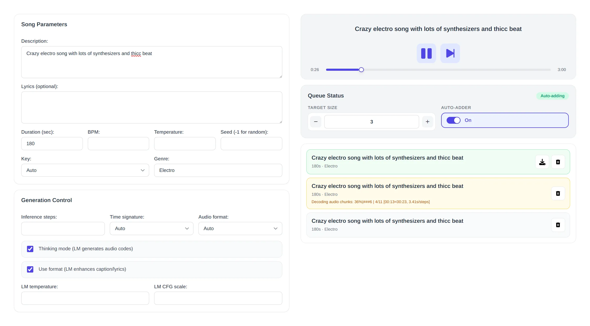

# ACE-Step Radio



A fun little PoC web app that generates music using [ACE-Step-1.5](https://github.com/ACE-Step/ACE-Step-1.5) and plays it back like a radio. Uses SvelteKit + Bun + Containers.

> This is just a side project/experiment, not production-ready code. Expect sub-optimal architecture and some hacky bits.

The main idea is to have an automatically playing "radio" that generates songs based on user prompts. This is done by pre-fetching songs beforehand and queuing them up, so there's always something playing.

## Features

- **Music Generation**: Create songs with ACE-Step-1.5 by describing what you want
- **Queue System**: Queue up song generation to keep the radio going
- **Container Setup**: Everything runs in containers

## Quick Start

### Prerequisites

- Container solution with compose support (Docker, Podman, etc.)
- NVIDIA GPU (for ACE-Step-1.5)

### Running

```bash
# Clone and go to the repo
cd ace-step-radio

# Start everything (builds containers on first run)
docker-compose up --build

# The web UI should be at http://localhost:3000
# The API runs on port 8001
```

To stop:

```bash
docker-compose down
```

## Configuration

### Environment Variables

Set these in `docker-compose.yml`:

- `ACESTEP_SERVER_URL`: Where the ACE-Step API lives (default: `http://acestep-api:8001`)
- `ORIGIN`: Where the web app is served (default: `http://localhost:3000`)

### ACE-Step-1.5 Settings

The API container has a bunch of defaults you can tweak:

- `DOWNLOAD_SOURCE`: Where to fetch models from (`auto`, `huggingface`, etc.)
- `ACESTEP_INIT_LLM`: Whether to initialize the LLM (`true`/`false`)

See [ACE-Step-1.5](https://github.com/ACE-Step/ACE-Step-1.5) for more options.

## Known Issues / Quirks

- **Cross-origin errors**: Make sure `ORIGIN` env var matches how you access the app
- **Bad unhappy path handling**: If something goes wrong during song generation, the app might not handle it gracefully. For now console / network tab / container logs are your best bet for debugging.

## Contributing

This is a PoC side-project, so... PRs probably not needed. But if you find bugs or have ideas, feel free to open issues!

## Credits

- [ACE-Step-1.5](https://github.com/ACE-Step/ACE-Step-1.5) for the music generation
- Svelte / SvelteKit team for the awesome framework
- Bun for the super-fast JavaScript runtime
